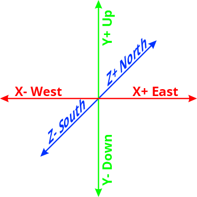
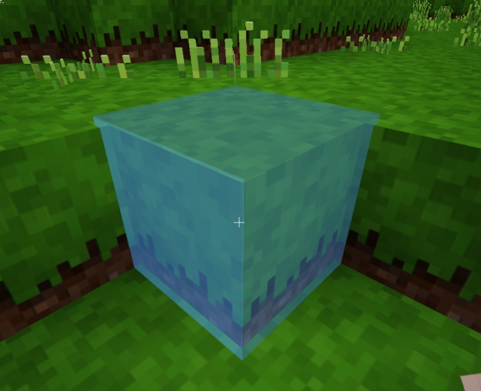

Basics
==========

   Minetest coordinate system

On this page we try to give you some basic informations needed to program for minetest.

Coordinates
---------------

To locate a random point in a three dimensional room, you need three axis: x, y and z.
X points east, Y up and Z north. There can also be negative values, where X- points west, Y- down and Z- south.

1 unit on these axis appears to a player as roughly 1 meter.

Nodes
-----------

   A node or block

Minetest uses the word "node" instead of "block", but it's basically the same thing you know form games like minecraft.

Nodes or blocks are the fundamental cubic unit of a world and appears to a player as roughly 1x1x1 meters in size.

.. hint:: You can count nodes to get the axis values and coordinates.
   Full numbers without decimals are every time the center of the node/cuboid.

