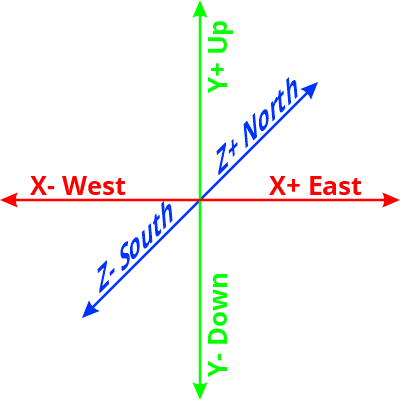
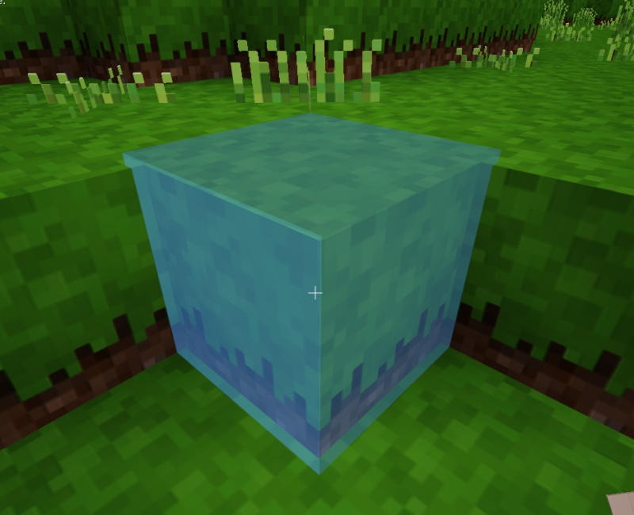

Basics
==========

   Luanti coordinate system

Three things to know before you start: how a world is measured, what it is built from, and the one object
your Python needs to talk to it.

🧭 Coordinates
---------------

To locate a point in a three dimensional space, you need three axes: x, y and z.
X points east, Y up and Z north. There can also be negative values, where X- points west, Y- down and Z- south.

1 unit on these axes appears to a player as roughly 1 meter.

🧱 Nodes
-----------

   A node or block

Luanti uses the word "node" instead of "block", but it's the same thing you know from games like Minecraft.

Nodes are the fundamental cubic unit of a world and appear to a player as roughly 1x1x1 meters in size.

.. hint:: You can count nodes to get the axis values and coordinates.
   A whole number without decimals is always the center of a node.

🐍 Meet ``lt``, your world in a variable
----------------------------------------

Every Miney program starts with the same two lines:

::

    import miney

    lt = miney.Luanti()

The first line brings Miney into your program. The second one connects to your world and puts that connection
into a variable named ``lt`` — short for **L**\ uan\ **t**\ i.

Everything you do goes through ``lt``. The players, the blocks, the chat, the time of day — they all hang off
that one object, so there is only ever one name you have to remember:

::

    lt.players.miney.position       # where the miney player stands
    lt.time_of_day = 0.5            # high noon
    lt.chat.send_to_all("Hello!")   # write into the game chat

.. important::

   Whenever you see ``lt`` in this documentation, it was created with those two lines. Examples leave them out
   to stay short, but your own file always needs them at the top.

The name ``lt`` is nothing special — it is a normal Python variable, and ``world = miney.Luanti()`` would work
just as well. We use ``lt`` everywhere because it is short to type, and short names matter when you are typing
them into a shell all day.

.. hint::

   If no world is running yet, ``miney.Luanti()`` starts one for you. But it is much more fun to run
   ``uv run miney start`` first, so you can watch your code change the world while it runs. See the
   :doc:`quickstart` if you have not done that yet.

🔎 Exploring in the Python shell
--------------------------------

Miney is designed to be highly interactive, making it perfect for use in a Python REPL (Read-Eval-Print Loop) or an IDE like IDLE. This allows you to explore the game world and the Miney API without needing to write and run a full script—an excellent way for beginners to learn and experiment.

Start the interactive shell from your ``miney-world`` folder with:

.. code-block:: text

   uv run python

Then create your ``lt`` object, exactly as you would in a file:

.. code-block:: python

   >>> import miney
   >>> lt = miney.Luanti()
   >>> lt
   <Luanti server "127.0.0.1:30000">

Everything you type from here on gets an answer straight away, and every answer is a real thing in your
running world.

.. note::

   IDLE is Python's Integrated Development and Learning Environment and is included with every Python installation.
   Start it with ``uv run python -m idlelib.idle``.

A key feature is dynamic auto-completion. Miney fetches information like node types and online player names from the server and makes them available for tab-completion in modern Python shells.

**Example: Interacting with Players**

You can easily see and interact with online players. Type `lt.players.` in your Python shell and press the `Tab` key. You will see a list of all online players. You can then access a player object directly by their name to get their properties.

.. code-block:: python
   :caption: Example of player completion in a Python REPL

   >>> lt.players.  # Press Tab
   lt.players.miney          lt.players.HumanPlayer          lt.players.Player3
   >>>
   >>> lt.players.HumanPlayer
   <Luanti Player "HumanPlayer">
   >>> lt.players.HumanPlayer.position
   <Luanti Point(x=-145.0, y=6.0, z=-243.0)>

**Example: Discovering Node Types**

Similarly, you can discover all available node types. Type `lt.nodes.names.` and press `Tab`. You'll see a list of all registered node names (e.g., `default:stone`, `flowers:rose`). You can then use these names as strings in functions that manipulate the world.

.. code-block:: python
   :caption: Discovering and using a node name

   >>> from miney import Node
   >>> lt.nodes.names.  # Press Tab
   >>> lt.nodes.names.default.  # Press Tab
   >>> lt.nodes.names.default.apple  # Press Enter
   'default:apple'
   >>> lt.nodes.set(Node(10, 20, 30, name=lt.nodes.names.default.apple))

This powerful interactive discovery feature significantly lowers the barrier to entry, especially in educational settings, as you can learn and explore what's possible directly within the Python shell.

