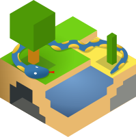

Welcome to the Miney documentation!
====================================

Miney provides an `Python <https://www.python.org/>`_ interface to `Luanti <https://www.luanti.org/>`_.

First goal is to have fun with a 3D sandbox for Python.

**Do whatever you like:**

* Play and fiddle around while learning python
* Visualize data in unusual ways
* Automate things with bots
* Connect Luanti to external services like discord, twitch or whatsoever
* Do whatever you want!

.. raw:: html

   <a href="https://discord.gg/jCzZ7qs6ZT" class="sd-card sd-bg-primary sd-p-2 d-block" style="text-decoration: none; max-width: 250px; margin: 1em auto;">
      

         
         <strong style="color: white;">Join the Miney community on Discord</strong>
      

   </a>

.. important::

   For the best way to get everything running, take a look at the :doc:`getting_started/quickstart` page.

.. warning::

   Miney is currently in beta, so it's usable but the API may change at any point.

Why Python?
-------------

.. image:: python-logo.png
   :alt: Python logo
   :align: right

Some marketing text from the `Python website <https://www.python.org/about/>`_:

   | Python is powerful... and fast;
   | plays well with others;
   | runs everywhere;
   | is friendly & easy to learn;
   | is Open.

   These are some of the reasons people who use Python would rather not use anything else.

And it's popular! Because of that it has a `giant package index <https://pypi.org/>`_ with hundreds of
thousands of ready-made packages — whatever you want to connect your world to, someone has probably already
written the Python for it.

Why Luanti?
---------------

Why not Minecraft? Luanti is free. You don't have to pay for it (consider a `donation <https://www.luanti.org/get-involved/#donate>`_!),
and it's open source too. That's a big point if you want to use this in a classroom.

Modding Minecraft isn't that easy either, because it has no official API and no embedded scripting language
like Lua. Mods have to be written in Java and recompiled on every Minecraft update, so many attempts at an
API have appeared and disappeared over the years.

Luanti modding in Lua is easy in contrast: no compilation, an official API, and all game logic is in Lua as well.

Support Miney
---------------------

.. raw:: html

    

Table of Contents
-----------------

.. toctree::
   :caption: Getting started

   getting_started/quickstart
   getting_started/basics
   getting_started/installation

.. toctree::
   :caption: Examples

   examples

.. toctree::
   :caption: Reference

   api/index
   changelog
   tech_background

Miney version: |release|
